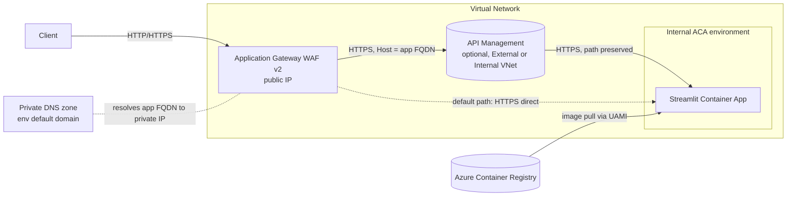

# Front a private Azure Container App with a WAF (and optional APIM)

An [Azure Developer CLI (`azd`)](https://learn.microsoft.com/azure/developer/azure-developer-cli/) template that stands up a **Streamlit** app on an **internal (VNet-isolated) Azure Container Apps** environment and fronts it with an **Application Gateway (WAF v2)**. An **API Management** tier (App Gateway → APIM → ACA) is available as an optional, documented add-on.

---

## Summary / use case

Teams frequently need to expose a private container app to clients through a managed front door for WAF, TLS, routing and (optionally) API governance. This template reproduces that pattern end to end so you can:

- Validate **App Gateway → internal ACA** connectivity for a real app (Streamlit, which uses WebSockets).
- Layer in **API Management** (App Gateway → APIM → ACA) when you need API policies, products, or a gateway in front of the app.
- Add **Microsoft Entra Easy Auth** on the container app and see the reverse-proxy header configuration required to make sign-in work.

It was built to investigate a real customer scenario ("App Gateway → APIM → Container Apps, getting 502/404, breaks after enabling Entra auth").

---

## Architecture



ASCII view:

```
Client ──► App Gateway (WAF v2, public IP)
                 │  (in VNet)
                 ├─ default ─────────────► Streamlit Container App (internal ACA env)
                 └─ optional ─► APIM ─────► Streamlit Container App
                                (External or Internal VNet mode, root path + Host/X-Forwarded headers)
Private DNS (env default domain) resolves the app FQDN to the env's private IP inside the VNet.
In Internal APIM mode a second private DNS zone (azure-api.net) resolves the APIM gateway host to its VNet IP.
Container image is pulled from ACR using a user-assigned managed identity (AcrPull).
```

**What gets deployed (default, `deployApim=false`):**

| Resource | Purpose |
|---|---|
| Virtual Network (`appgw`, `apim`, `aca-infra` subnets) | Network isolation; ACA infra subnet is delegated to `Microsoft.App/environments`. |
| User-assigned managed identity + AcrPull | Container app pulls its image from ACR without admin creds. |
| Azure Container Registry (Basic) | Holds the image `azd` builds from `./src`. |
| Internal ACA managed environment | Private (no public endpoint) Consumption environment. |
| Private DNS zone (env default domain) | Lets in-VNet front ends resolve the app FQDN to the env's private IP. |
| Streamlit Container App | The workload (port 8501, WebSocket-capable). Tagged `azd-service-name: streamlit`. |
| Application Gateway (WAF v2) + public IP | Public front door; HTTP listener; HTTPS to the backend with Host = app FQDN; health probe accepts `200-399`. |
| API Management (optional) | External (default) or Internal VNet-mode gateway in front of the app. Internal mode also deploys a private DNS zone (`azure-api.net`) so the App Gateway resolves the gateway host to APIM's VNet IP. |

---

## Requirements

- [Azure Developer CLI (`azd`)](https://aka.ms/azd-install) 1.9+
- [Azure CLI (`az`)](https://learn.microsoft.com/cli/azure/install-azure-cli)
- Docker (for `azd` to build the container image), or run `azd deploy` where a remote build is available
- An Azure subscription and permission to create the resources above
- Provider registrations: `Microsoft.App`, `Microsoft.Network`, `Microsoft.ContainerRegistry`, and (for the optional tier) `Microsoft.ApiManagement`

---

## Quick start

```bash
# 1. Authenticate (azd can reuse the Azure CLI login)
az login
azd config set auth.useAzCliAuth true

# 2. Initialize an environment
azd env new testing-aca-apim
azd env set AZURE_LOCATION swedencentral
azd env set AZURE_SUBSCRIPTION_ID <your-subscription-id>
azd env set AZURE_RESOURCE_GROUP testing-aca-apim

# 3. Provision infrastructure AND build/deploy the Streamlit image
azd up

# 4. Browse the app through the WAF (printed as APPLICATION_GATEWAY_URL)
```

`azd up` provisions the infra (the container app starts on a placeholder image), then builds the image from `./src`, pushes it to the provisioned ACR, and updates the container app.

### Enable the optional APIM tier

```bash
# Edit infra/main.parameters.json to add:  "deployApim": { "value": true }
azd provision
```

The APIM API is mounted at the gateway **root** (`path: ''`) with catch-all operations (`/*` for every HTTP method), so App Gateway can forward `/` straight through and APIM proxies the full request path unchanged — no path prefix (`/app`, `/api`, …) is required or expected. The inbound policy preserves the original path (no `rewrite-uri`), sets `Host` to the ACA FQDN for ingress SNI, and sets `X-Forwarded-Host`/`X-Forwarded-Proto` to the external App Gateway host so Easy Auth redirects resolve to the front door rather than the internal ACA URL.

#### External vs Internal VNet mode

APIM defaults to **External** VNet mode (the gateway has a public endpoint; the App Gateway reaches it over its public FQDN). To deploy APIM in **Internal** mode — where the gateway is reachable only from inside the VNet and the App Gateway is the sole public entry point — set `apimInternal=true`:

```bash
# Edit infra/main.parameters.json to add, alongside deployApim:
#   "apimInternal": { "value": true }
azd provision
```

In Internal mode the template also deploys a private DNS zone (`azure-api.net`) linked to the VNet, with A records (gateway, management, portal, developer, scm) pointing at the APIM service's private VNet IP. This lets the in-VNet App Gateway resolve `apim-<token>.azure-api.net` to the private IP and reach the gateway over HTTPS with a valid SNI/cert. No other configuration changes: the App Gateway backend, probe, and routing rule are identical to External mode. Internal mode still requires the subnet NSG to allow inbound `3443` from the `ApiManagement` service tag for API/policy config (see Limitations).

### Enable Easy Auth (Entra)

1. Create an Entra app registration; add redirect URI `https://<frontend-host>/.auth/login/aad/callback`, where `<frontend-host>` is the **App Gateway** public FQDN (not the ACA FQDN).
2. Set parameters: `enableEasyAuth=true`, `entraClientId`, `entraTenantId`, `entraClientSecret`.
3. `azd provision`.

The template sets `forwardProxy.convention = Standard` so Easy Auth builds OAuth redirect URIs from the **external** host/scheme. With the APIM tier, that external host is propagated via the `X-Forwarded-Host` header set in the APIM policy; without it Easy Auth would fall back to the `Host` header (the ACA FQDN) and redirect to the internal URL.

### Easy Auth (interactive login) vs APIM `validate-jwt`

These are two **different** auth models — don't conflate them:

- **Easy Auth** (this template) is interactive, browser-based, cookie sign-in. The user is redirected to Entra, signs in, and the container app receives a session cookie. Use it for human-facing apps (like the Streamlit front end).
- **APIM `validate-jwt`** validates a **bearer token** that an API client already holds. It does not perform an interactive login. Adding `validate-jwt` to the API policy in front of an Easy-Auth-protected browser app will reject normal browser requests (no `Authorization: Bearer` header) and is the usual cause of "missing in app registration" / redirect confusion.

If you need bearer-token enforcement at APIM (machine-to-machine clients), add `validate-jwt` to the inbound policy and have clients present a token — but expose that as a separate API/flow from the interactive Easy Auth path.

---

## Limitations

- **APIM in network-restricted / corporate subscriptions.** Deploying APIM into a VNet (Internal *or* External mode) and configuring its APIs via ARM requires the APIM resource provider to reach the service's management endpoint on TCP **3443**. In some locked-down subscriptions (e.g. with centrally managed NSG/route/firewall policy) that path is blocked even when the subnet NSG is correct and the endpoint is publicly reachable, and API creation fails with `ManagementApiRequestFailed`. The APIM **service** still provisions; only the **API/policy** push fails. In that case use the default (App Gateway → ACA direct) path, or deploy APIM in a subscription without that restriction. This is an environment constraint, not a template defect.
- **APIM Developer SKU** has no SLA and provisions in ~35–45 minutes.
- The default App Gateway listener is **HTTP** (no certificate) to keep first-run simple. For production, switch the listener to HTTPS with a real (Key Vault) certificate.
- **Easy Auth over an HTTP front end is not supported in practice.** Easy Auth expects HTTPS; an HTTP front + Easy Auth produces redirect/cookie scheme mismatches. Use HTTPS end to end.
- Internal ACA environment provisioning time and regional capacity vary; under capacity pressure the environment can take much longer than usual.

---

## Troubleshooting

| Symptom | Likely cause / fix |
|---|---|
| **App Gateway returns 502** | Backend probe unhealthy. The probe accepts `200-399`; confirm the app responds on `/` (direct) or APIM responds on `/status-0123456789abcdef` (APIM tier). Check that the App Gateway backend `hostName` and probe `host` are the backend FQDN (SNI/Host must match the backend's ingress certificate). |
| **App Gateway returns 404 (APIM tier)** | Routing/operation miss. The API must be mounted at the **root** path (`path: ''`) and expose **catch-all operations** (`/*` per method); otherwise APIM can't match `/` and returns 404 for everything. Do **not** add an `/app` or `/api` prefix — the gateway forwards `/` unchanged. Direct to ACA, confirm the routing rule points at the ACA backend pool. |
| **`ManagementApiRequestFailed` / cannot connect to `*.management.azure-api.net:3443`** | APIM management-plane connectivity (see Limitations). Verify the subnet NSG allows inbound `3443` from the `ApiManagement` service tag and `6390` from `AzureLoadBalancer`; if it still fails in a corp subscription, use the App Gateway → ACA direct path. |
| **App Gateway 502 in Internal APIM mode** | The gateway host must resolve to APIM's private IP. Confirm the `azure-api.net` private DNS zone is linked to the VNet and its A records point at the APIM service's VNet IP (the template's `apimPrivateDns` module does this when `apimInternal=true`). A public-DNS resolution to the (now unreachable) public endpoint shows up as a 502/timeout. |
| **Container app unhealthy right after `azd provision`** | Expected: it starts on a placeholder image until `azd deploy` pushes the Streamlit image. Run `azd deploy` (or `azd up`). |
| **Streamlit shows a blank page / WebSocket errors** | Ensure App Gateway/APIM forward WebSockets (`/_stcore/stream`) and the app runs with CORS/XSRF disabled behind the proxy (already set in `./src/Dockerfile`). |
| **Easy Auth redirect loop / redirects to the internal ACA URL** | The reverse proxy must forward the external host/scheme. Keep `forwardProxy.convention = Standard`; with APIM, ensure the inbound policy sets `X-Forwarded-Host` to the App Gateway host and `X-Forwarded-Proto: https` (set by this template). Use an HTTPS front end and register the exact App Gateway redirect URI in Entra. A redirect to the internal `*.azurecontainerapps.io` URL means the external host wasn't forwarded. |
| **Login works but APIM `validate-jwt` rejects browser requests** | `validate-jwt` expects a bearer token; interactive Easy Auth uses cookies. Don't put `validate-jwt` in front of the interactive browser app — see "Easy Auth vs APIM `validate-jwt`" above. |
| **`ImagePullBackOff` on the container app** | The user-assigned identity needs `AcrPull` on the registry (granted by the template) and the registry must be reachable; re-run `azd provision` if the role assignment lagged. |

---

## Project layout

```
testing-aca-apim/
├─ azure.yaml                     # azd service definition (streamlit -> containerapp)
├─ infra/
│  ├─ main.bicep                  # subscription scope: creates the resource group
│  ├─ main.parameters.json        # azd parameter bindings
│  ├─ resources.bicep             # all resources (network, ACR, identity, ACA, App Gateway)
│  └─ modules/
│     ├─ acaPrivateDns.bicep      # private DNS for the env default domain
│     ├─ apimPrivateDns.bicep     # private DNS (azure-api.net) for Internal-mode APIM
│     └─ apim.bicep               # optional APIM tier (External or Internal VNet mode)
└─ src/
   ├─ Dockerfile                  # Streamlit image (port 8501)
   └─ app.py                      # minimal Streamlit app; shows proxy/auth headers
```
