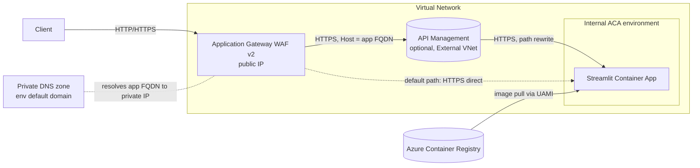

# Front a private Azure Container App with a WAF (and optional APIM)

An [Azure Developer CLI (`azd`)](https://learn.microsoft.com/azure/developer/azure-developer-cli/) template that stands up a **Streamlit** app on an **internal (VNet-isolated) Azure Container Apps** environment and fronts it with an **Application Gateway (WAF v2)**. An **API Management** tier (App Gateway → APIM → ACA) is available as an optional, documented add-on.

---

## Summary / use case

Teams frequently need to expose a private container app to clients through a managed front door for WAF, TLS, routing and (optionally) API governance. This template reproduces that pattern end to end so you can:

- Validate **App Gateway → internal ACA** connectivity for a real app (Streamlit, which uses WebSockets).
- Layer in **API Management** (App Gateway → APIM → ACA) when you need API policies, products, or a gateway in front of the app.
- Add **Microsoft Entra Easy Auth** on the container app and see the reverse-proxy header configuration required to make sign-in work.

It was built to investigate a real customer scenario ("App Gateway → APIM → Container Apps, getting 502/404, breaks after enabling Entra auth").

---

## Architecture



ASCII view:

```
Client ──► App Gateway (WAF v2, public IP)
                 │  (in VNet)
                 ├─ default ─────────────► Streamlit Container App (internal ACA env)
                 └─ optional ─► APIM ─────► Streamlit Container App
                                (External VNet mode, path rewrite + Host override)
Private DNS (env default domain) resolves the app FQDN to the env's private IP inside the VNet.
Container image is pulled from ACR using a user-assigned managed identity (AcrPull).
```

**What gets deployed (default, `deployApim=false`):**

| Resource | Purpose |
|---|---|
| Virtual Network (`appgw`, `apim`, `aca-infra` subnets) | Network isolation; ACA infra subnet is delegated to `Microsoft.App/environments`. |
| User-assigned managed identity + AcrPull | Container app pulls its image from ACR without admin creds. |
| Azure Container Registry (Basic) | Holds the image `azd` builds from `./src`. |
| Internal ACA managed environment | Private (no public endpoint) Consumption environment. |
| Private DNS zone (env default domain) | Lets in-VNet front ends resolve the app FQDN to the env's private IP. |
| Streamlit Container App | The workload (port 8501, WebSocket-capable). Tagged `azd-service-name: streamlit`. |
| Application Gateway (WAF v2) + public IP | Public front door; HTTP listener; HTTPS to the backend with Host = app FQDN; health probe accepts `200-499`. |
| API Management (optional) | External VNet-mode gateway in front of the app. |

---

## Requirements

- [Azure Developer CLI (`azd`)](https://aka.ms/azd-install) 1.9+
- [Azure CLI (`az`)](https://learn.microsoft.com/cli/azure/install-azure-cli)
- Docker (for `azd` to build the container image), or run `azd deploy` where a remote build is available
- An Azure subscription and permission to create the resources above
- Provider registrations: `Microsoft.App`, `Microsoft.Network`, `Microsoft.ContainerRegistry`, and (for the optional tier) `Microsoft.ApiManagement`

---

## Quick start

```bash
# 1. Authenticate (azd can reuse the Azure CLI login)
az login
azd config set auth.useAzCliAuth true

# 2. Initialize an environment
azd env new testing-aca-apim
azd env set AZURE_LOCATION swedencentral
azd env set AZURE_SUBSCRIPTION_ID <your-subscription-id>
azd env set AZURE_RESOURCE_GROUP testing-aca-apim

# 3. Provision infrastructure AND build/deploy the Streamlit image
azd up

# 4. Browse the app through the WAF (printed as APPLICATION_GATEWAY_URL)
```

`azd up` provisions the infra (the container app starts on a placeholder image), then builds the image from `./src`, pushes it to the provisioned ACR, and updates the container app.

### Enable the optional APIM tier

```bash
# Edit infra/main.parameters.json to add:  "deployApim": { "value": true }
azd provision
```

### Enable Easy Auth (Entra)

1. Create an Entra app registration; add redirect URI `https://<frontend-host>/.auth/login/aad/callback`.
2. Set parameters: `enableEasyAuth=true`, `entraClientId`, `entraTenantId`, `entraClientSecret`.
3. `azd provision`.

The template sets `forwardProxy.convention = Standard` so Easy Auth builds OAuth redirect URIs from the **external** host/scheme (required behind App Gateway/APIM).

---

## Limitations

- **APIM in network-restricted / corporate subscriptions.** Deploying APIM into a VNet (Internal *or* External mode) and configuring its APIs via ARM requires the APIM resource provider to reach the service's management endpoint on TCP **3443**. In some locked-down subscriptions (e.g. with centrally managed NSG/route/firewall policy) that path is blocked even when the subnet NSG is correct and the endpoint is publicly reachable, and API creation fails with `ManagementApiRequestFailed`. The APIM **service** still provisions; only the **API/policy** push fails. In that case use the default (App Gateway → ACA direct) path, or deploy APIM in a subscription without that restriction. This is an environment constraint, not a template defect.
- **APIM Developer SKU** has no SLA and provisions in ~35–45 minutes.
- The default App Gateway listener is **HTTP** (no certificate) to keep first-run simple. For production, switch the listener to HTTPS with a real (Key Vault) certificate.
- **Easy Auth over an HTTP front end is not supported in practice.** Easy Auth expects HTTPS; an HTTP front + Easy Auth produces redirect/cookie scheme mismatches. Use HTTPS end to end.
- Internal ACA environment provisioning time and regional capacity vary; under capacity pressure the environment can take much longer than usual.

---

## Troubleshooting

| Symptom | Likely cause / fix |
|---|---|
| **App Gateway returns 502** | Backend probe unhealthy. The probe accepts `200-499`; confirm the app responds on `/`. Check that the App Gateway backend `hostName` and probe `host` are the app FQDN (SNI/Host must match the ACA ingress certificate). |
| **App Gateway returns 404** | Path/routing. With APIM, confirm the API `path` and the `rewrite-uri` policy. Direct to ACA, confirm the routing rule points at the ACA backend pool. |
| **`ManagementApiRequestFailed` / cannot connect to `*.management.azure-api.net:3443`** | APIM management-plane connectivity (see Limitations). Verify the subnet NSG allows inbound `3443` from the `ApiManagement` service tag and `6390` from `AzureLoadBalancer`; if it still fails in a corp subscription, use the App Gateway → ACA direct path. |
| **Container app unhealthy right after `azd provision`** | Expected: it starts on a placeholder image until `azd deploy` pushes the Streamlit image. Run `azd deploy` (or `azd up`). |
| **Streamlit shows a blank page / WebSocket errors** | Ensure App Gateway/APIM forward WebSockets (`/_stcore/stream`) and the app runs with CORS/XSRF disabled behind the proxy (already set in `./src/Dockerfile`). |
| **Easy Auth redirect loop / fails from outside** | The reverse proxy must forward the external host/scheme. Keep `forwardProxy.convention = Standard`, use an HTTPS front end, and register the exact redirect URI in Entra. |
| **`ImagePullBackOff` on the container app** | The user-assigned identity needs `AcrPull` on the registry (granted by the template) and the registry must be reachable; re-run `azd provision` if the role assignment lagged. |

---

## Project layout

```
testing-aca-apim/
├─ azure.yaml                     # azd service definition (streamlit -> containerapp)
├─ infra/
│  ├─ main.bicep                  # subscription scope: creates the resource group
│  ├─ main.parameters.json        # azd parameter bindings
│  ├─ resources.bicep             # all resources (network, ACR, identity, ACA, App Gateway)
│  └─ modules/
│     ├─ acaPrivateDns.bicep      # private DNS for the env default domain
│     └─ apim.bicep               # optional APIM tier (External VNet mode)
└─ src/
   ├─ Dockerfile                  # Streamlit image (port 8501)
   └─ app.py                      # minimal Streamlit app; shows proxy/auth headers
```
